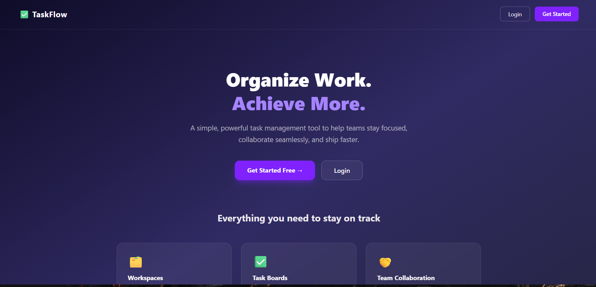
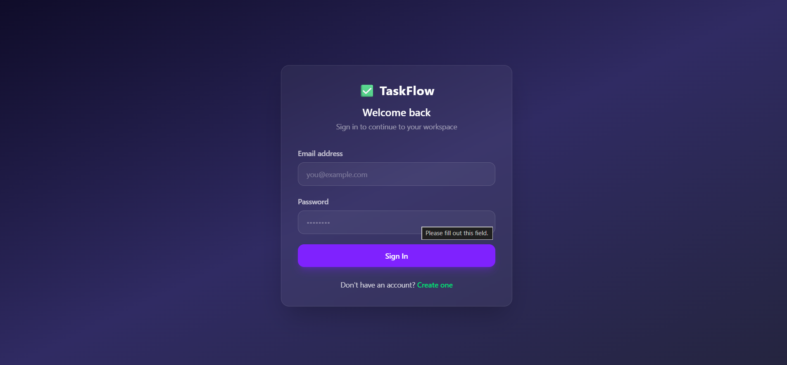
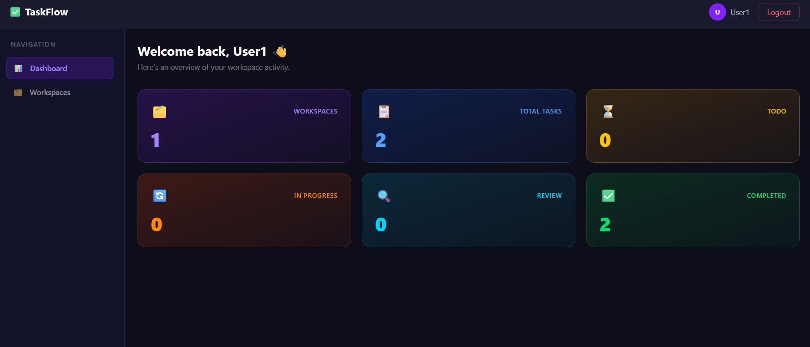

# TaskFlow — Premium MERN Task Management System

TaskFlow is a premium, responsive task management platform built on the MERN stack (MongoDB, Express, React, Node.js). Designed with a modern, glassmorphic dark theme (indigo/violet accents), TaskFlow delivers a sleek, intuitive interface for seamless team collaboration and task management.

---

## 📸 Screenshots

| Landing Page | Login Screen | Dashboard |
| :---: | :---: | :---: |
|  |  |  |

| Admin Dashboard | | |
| :---: | :---: | :---: |
|  | | |

---

## 🎨 Design Philosophy & UX
- **Glassmorphic Dark Mode**: Designed using rich gradient dark fills (`bg-[#0e0e1a]`/`bg-[#12122a]`), translucent borders (`border-white/10`), blur backdrops, and glowing violet hover cues.
- **Mobile First Responsive Layout**: Dynamic layout configuration hides side navigation on mobile viewports and replaces it with a clean sliding drawer menu toggled by a hamburger button (`☰` / `⛌`).
- **Interactive Forms**: Modals are configured with double-confirmation dialogs, locked click-outside closures, and specific dark/light theme adjustments (`[color-scheme:dark]`).

---

## 🚀 Key Features

### 🔑 Authentication & Session Sync
- **Secure JWT Auth**: Encrypted token-based login and registration flows.
- **Session Auto-Redirects**: Prevents active session users from accessing `/login` or `/register` by routing them directly to `/dashboard`.
- **Live Role Synchronization**: Layout component polls `/auth/me` and triggers an in-place session refresh when the user's role is updated, bypassing stale tokens.

### 🗂️ Workspace Management
- **Workspaces Dashboard**: Personalized greeting with quick status breakdown metrics.
- **Members Management**: Owner and administrators can invite new members by email, or remove existing members from a workspace.
- **Details Panel**: Live tracking showing list of members (roles/avatars) and all active tasks.

### 📋 Collaborative Task Lifecycle
- **Role-Based Workflows**:
  - **Managers/Admins**: Full CRUD permissions to create, assign, update priority/deadlines, and change status to **Completed**.
  - **Members**: Restructured permissions to update task status up to **Review** but locked out from finalizing status to **Completed**.
- **Completed Task Locking**: Completed tasks display a green locked border, disable selectors, and hide edit controls to prevent modifications.

### 🛡️ Admin Panel
- **System Overview**: Interactive metrics showcasing system-wide counts (Total Users, Workspaces, Tasks) and active task statuses.
- **Manage Users**:
  - Review all users in the system.
  - Change user roles (`member`, `manager`, `admin`) with confirm prompts.
  - Delete user accounts safely (excludes self-deletion/lockouts).
- **Manage Workspaces**: Read-only directory tracking member and task loads with one-click workspace deletion.
- **Manage Tasks**: Multi-dimensional search and drop-down filters (filter by Workspace, Status, or Priority) with detail view modals and delete buttons.

---

## 💻 Technology Stack

### Frontend
- **Framework**: React 18, Vite
- **Styling**: Tailwind CSS
- **Routing**: React Router DOM (v6)
- **HTTP Client**: Axios (configured with interceptors to inject JWT headers)

### Backend
- **Server**: Node.js, Express.js
- **Database**: MongoDB (via Mongoose)
- **Security**: JSON Web Tokens (JWT), Bcrypt password hashing
- **Middleware**: Live verification token database checks (prevents stale roles in JWT)

---

## 📂 Project Structure

```
Task-management/
├── client/                     # Frontend Application
│   ├── src/
│   │   ├── api/                # Axios API base configuration
│   │   ├── components/         # Layout, Navbar, Sidebar, TaskCard, Modal
│   │   ├── pages/              # Auth pages, Workspace, Task, Admin panels
│   │   ├── routes/             # Protected / Public Auth Guards
│   │   ├── utils/              # handlechange event handlers
│   │   └── App.jsx             # React routing configurations
├── server/                     # Backend API
│   ├── controller/             # Business logic controllers
│   ├── middleware/             # verifyToken and authorizeRoles guards
│   ├── models/                 # MongoDB schemas (User, Workspace, Task)
│   ├── routes/                 # REST API routers
│   └── server.js               # Express entrypoint
```

---

## ⚙️ How to Get Started

### Prerequisites
- Node.js installed
- MongoDB connection string (local or Atlas)

### Setup Server
1. Navigate to `/server`:
   ```bash
   cd server
   ```
2. Install dependencies:
   ```bash
   npm install
   ```
3. Create a `.env` file:
   ```env
   PORT=3000
   MONGO_URI=your_mongodb_connection_string
   SECRET_KEY=your_jwt_signing_secret
   ```
4. Start development server:
   ```bash
   npm start
   ```

### Setup Client
1. Navigate to `/client`:
   ```bash
   cd client
   ```
2. Install dependencies:
   ```bash
   npm install
   ```
3. Start Vite dev server:
   ```bash
   npm run dev
   ```
